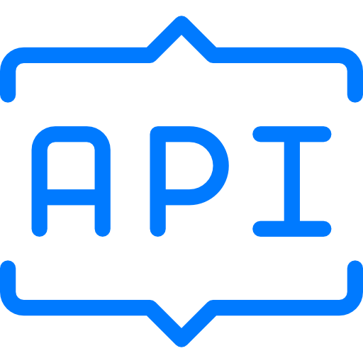

# A Password Manager Rest API Example
<!-- https://github.com/othneildrew/Best-README-Template -->
<a name="readme-top"></a>

<!-- PROJECT SHIELDS -->
<!--
*** https://www.markdownguide.org/basic-syntax/#reference-style-links
-->
[![Issues][issues-shield]][issues-url]
[![APACHE 2.0 License][license-shield]][license-url]

<!-- PROJECT LOGO -->
<br />
<div align="center">
  <a href="https://github.com/ToulisDev/PasswordManagerRestApi">
    
  </a>

<h3 align="center">Password Manager Rest-Api</h3>

  <p align="center">
    A REST-API that communicates between the user and a simple Microsoft SQL Database.
    <br />
    <a href="https://github.com/ToulisDev/PasswordManagerRestApi"><strong>Explore the docs »</strong></a>
    <br />
    <br />
    <a href="https://github.com/ToulisDev/PasswordManagerRestApi/issues">Report Bug</a>
    ·
    <a href="https://github.com/ToulisDev/PasswordManagerRestApi/issues">Request Feature</a>
  </p>
</div>

<!-- TABLE OF CONTENTS -->
<details>
  <summary>Table of Contents</summary>
  <ol>
    <li>
      <a href="#about-the-project">About The Project</a>
      <ul>
        <li><a href="#built-with">Built With</a></li>
      </ul>
    </li>
    <li>
      <a href="#getting-started">Getting Started</a>
      <ul>
        <li><a href="#prerequisites">Prerequisites</a></li>
        <li><a href="#installation">Installation</a></li>
      </ul>
    </li>
    <li><a href="#usage">Usage</a></li>
    <li><a href="#contributing">Contributing</a></li>
    <li><a href="#license">License</a></li>
    <li><a href="#contact">Contact</a></li>
  </ol>
</details>

<!-- ABOUT THE PROJECT -->
## About The Project

[![PM REST-API Swagger Screenshot][product-screenshot]](http://localhost:730/swagger/index.html)

This project is a simple REST-API for a password manager application. It is a simple login system with create and update passwords. The login system uses Argon algorithm to validate and create passwords.

<p align="right">(<a href="#readme-top">back to top</a>)</p>

### Built With

* [![C#][CSharp]][CSharp-url]
* [![.Net][dotNet]][dotNet-url]
* [![VisualStudio][VisualStudio]][VisualStudio-url]
* [![MSSqlServer][MSSqlServer]][MSSqlServer-url]

<p align="right">(<a href="#readme-top">back to top</a>)</p>

<!-- GETTING STARTED -->
## Getting Started

In order to get up and running the Rest-API, you need to build the project using VS Studio for the corresponding OS (Linux or Windows). You will also have to update `appsettings.json` with your personal settings. You might also want to change the port that the app is listening to via `Program.cs`. The API was built to communicate with *MS SQL Database*, so you have to setup a database using MSSQL or you could implement and change the code to work with your Database.

### Prerequisites

* Microsoft SQL Server
  * [SQL Server on Linux](https://docs.microsoft.com/en-us/sql/linux/sql-server-linux-overview?view=sql-server-ver16)
  * [SQL Server installation guide](https://docs.microsoft.com/en-us/sql/database-engine/install-windows/install-sql-server?view=sql-server-ver16)
* [Visual Studio](https://visualstudio.microsoft.com/)

### Installation

1. Download and Install MS SQL Server.
2. Create a Database

   ```sql
   CREATE DATABASE YourDatabaseName;
   ```

3. Create the following tables and columns inside the Database you just created.

    `PASSWORDS` Table

    * PASSWORDS_ID
    * PASSWORDS_SITE
    * PASSWORDS_USERNAME
    * PASSWORDS_PASSWORD
    * PASSWORDS_WEBSITE
    * PASSWORDS_INSERT_DATE
    * USER_ID

    `USERS` Table

    * USER_ID
    * USERNAME
    * PASSWORD
    * INSERT_DATE

4. Create and assign the following Stored Procedures to the Database you just created.

    * validateLoginCreds
    * registerLoginCreds
    * createPassword
    * getallPasswords
    * getSpecPassword
    * updatePassword
    * deletePasswordNote
    * existantPasswordNote

5. Create a Login User with **above stored procedure exec permission only** and assign him to the database you just created.
6. Open VS Studio and open the above project.
7. Replace `appsettings.json` with your corresponding info and Replace on `Program.cs` with your port and IP.

    ```c#
    app.Urls.Add("http://localhost:730");
    ```

8. Build project using *Publish* feature of Visual Studio for the host OS.

<p align="right">(<a href="#readme-top">back to top</a>)</p>

<!-- USAGE EXAMPLES -->
## Usage

Every communication is using POST Requests. In order to use requests such as `GetPasswords` and `UpdatePassword`, you need to get an authorization token first using `Auth/login` post Request.

<p align="right">(<a href="#readme-top">back to top</a>)</p>

<!-- CONTRIBUTING -->
## Contributing

Contributions are what make the open source community such an amazing place to learn, inspire, and create. Any contributions you make are **greatly appreciated**.

If you have a suggestion that would make this better, please fork the repo and create a pull request. You can also simply open an issue with the tag "enhancement".
Don't forget to give the project a star! Thanks again!

1. Fork the Project
2. Create your Feature Branch (`git checkout -b feature/AmazingFeature`)
3. Commit your Changes (`git commit -m 'Add some AmazingFeature'`)
4. Push to the Branch (`git push origin feature/AmazingFeature`)
5. Open a Pull Request

<p align="right">(<a href="#readme-top">back to top</a>)</p>

<!-- LICENSE -->
## License

Distributed under the APACHE 2.0 License. See `LICENSE` for more information.

<p align="right">(<a href="#readme-top">back to top</a>)</p>

<!-- CONTACT -->
## Contact

Aggelos S. - aggelos_sachtouris@hotmail.com

Project Link: [https://github.com/ToulisDev/PasswordManagerRestApi](https://github.com/ToulisDev/PasswordManagerRestApi)

<p align="right">(<a href="#readme-top">back to top</a>)</p>

<!-- MARKDOWN LINKS & IMAGES -->
<!-- https://www.markdownguide.org/basic-syntax/#reference-style-links -->
[issues-shield]: https://img.shields.io/github/issues/ToulisDev/PasswordManagerRestApi?style=for-the-badge
[issues-url]: https://github.com/ToulisDev/PasswordManagerRestApi/issues
[license-shield]: https://img.shields.io/github/license/ToulisDev/PasswordManagerRestApi?style=for-the-badge
[license-url]: https://github.com/ToulisDev/PasswordManagerRestApi/blob/main/LICENSE
[product-screenshot]: images/screenshot.png
[VisualStudio]: https://img.shields.io/badge/Visual_Studio-5C2D91?style=for-the-badge&logo=visual%20studio&logoColor=white
[VisualStudio-url]: https://visualstudio.microsoft.com/
[dotNet]: https://img.shields.io/badge/.NET-5C2D91?style=for-the-badge&logo=.net&logoColor=white
[dotNet-url]: https://dotnet.microsoft.com/en-us/
[CSharp]: https://img.shields.io/badge/C%23-239120?style=for-the-badge&logo=c-sharp&logoColor=white
[CSharp-url]: https://docs.microsoft.com/en-us/dotnet/csharp/
[MSSqlServer]: https://img.shields.io/badge/Microsoft_SQL_Server-CC2927?style=for-the-badge&logo=microsoft-sql-server&logoColor=white
[MSSqlServer-url]: https://www.microsoft.com/en-us/sql-server/
